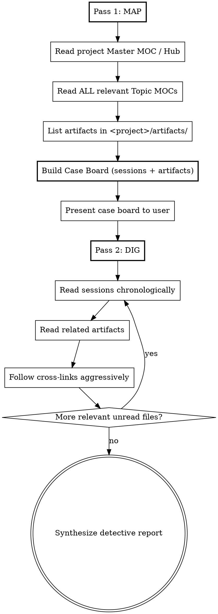

# Detective — Deep Graph Investigation

Build the **complete picture** of a topic by systematically mapping and investigating the knowledge graph — including session logs AND the plan/design/spec/brainstorm artifacts linked from them. Unlike `/harpoon` (quick answer, ~10 reads), detective does exhaustive two-pass research (~30 reads).

## Invocation

- `/detective <topic or question>` — investigate within the current project
- `/detective <topic> in <project>` — investigate a specific project
- `/detective <topic> --all` — investigate across all projects (expensive; use when a topic genuinely spans projects)
- `/detective` — ask the user what they want to investigate

## The Rules

1. **Pass 1 before Pass 2** — read ALL relevant MOCs AND list all relevant artifacts to build the case board BEFORE reading any session or artifact file in full
2. **Never grep session files or artifacts directly** — discover them through MOCs or through session-log frontmatter
3. **Always start at the project's Master MOC (or Hub)** — entry point, not optional
4. **Build the case board explicitly** — list every session AND every artifact to investigate before opening them
5. **Artifacts are first-class evidence** — a single plan or design doc often contains more decision history than three session summaries combined

## Resolve the Vault Root

Run this command with the Bash tool:

```bash
v="${AGENT_CONTEXT_VAULT%/}"; echo "vault=${v:-UNSET}"; [ -d "$v" ] && echo "status=ok" || echo "status=missing"
```

- `vault=UNSET` → stop and tell the user:

  > `AGENT_CONTEXT_VAULT` is not set. Add `{ "env": { "AGENT_CONTEXT_VAULT": "/absolute/path/to/vault" } }` to `~/.claude/settings.json`, then start a new session.

- `status=missing` → stop and tell the user that the vault directory does not exist at the printed path.
- `status=ok` → use the printed path as `<vault>` in every path below. Use it exactly as printed (case-sensitive). Do not search for the vault anywhere else.

## Determining Scope

1. If the user specified `in <project>`, use that as `<project>`.
2. If the user passed `--all`, scope is all project folders — read each project's Master MOC in Pass 1.
3. Otherwise, use the basename of the current working directory as `<project>`.

Project folder: `<vault>/<project>/`.

If the folder does not exist, tell the user:

> No vault folder for `<project>`. Try `/detective <topic> --all` or `/detective <topic> in <project-name>`.

and stop.

## Two-Pass Algorithm



### Pass 1 — MAP (Build the Case Board)

**Goal:** See the full landscape before reading any details.

1. **Read the project's root hub**, in this preference order:
   - `<project>/00 - Master MOC.md`
   - `<project>/00 - <project> Hub.md`
   - `<project>/00 - Archive Hub.md`
   - Any file matching `<project>/00 - *.md`

2. **Read ALL topic MOCs relevant to the investigation** — not just 1-3 like harpoon. Cast a wide net. The Master MOC lists every topic MOC in its table; match on name and description.

   **Generic matching heuristics (topic MOC names vary per project — discover from the Master MOC):**

   | Topic signals | MOCs to prefer |
   |---------------|----------------|
   | bug, error, crash, regression, broke | `Bug Tracker MOC`, `Bugs MOC` |
   | migration, upgrade, port, rewrite | `* Migration MOC` |
   | reports, scheduling, jobs, cron | `Report * MOC`, `Cron MOC` |
   | database, query, schema, index | `Database * MOC`, `MongoDB MOC`, `MSSQL MOC` |
   | aws, s3, sqs, lambda | `AWS Services MOC` |
   | email, mailer, SMTP, SendGrid | `Email * MOC` |
   | packages, deps, version | `Dependency Cleanup MOC` |
   | express, routing, api, middleware | `Express * MOC`, `API MOC` |
   | redis, caching, ioredis | `Redis MOC` |
   | patterns, architecture, design | `Architecture Patterns MOC` |
   | specific module/file | `Project Module MOC` |
   | billing, contracts, licensing | `Billing * MOC`, `Contracts MOC` |
   | timeline, history, when did | `Timeline MOC` |

   When uncertain, read it. Pass 1 is where you over-cast.

3. **List (do not read) artifacts in `<project>/artifacts/`.** Scan the directory listing. Note which artifacts have filenames matching the topic keywords. These are investigation leads — they will be opened in Pass 2.

4. **Build the Case Board** — extract every session link AND every candidate artifact mentioned in the MOCs or matched by name. Deduplicate. Sort sessions chronologically; group artifacts by type (plan / design / brainstorm / spec / review).

**Output the case board before proceeding:**

```markdown
## Case Board: <topic>

**Project:** <project>
**MOCs consulted:** <list>
**Sessions to investigate:** <count>
**Artifacts to investigate:** <count>

### Sessions (chronological)
| # | Session | From MOC | One-liner |
|---|---------|----------|-----------|
| 1 | [[2026-MM-DD_HH-MM-SS]] | Report System MOC | what it's about |
| 2 | ... | ... | ... |

### Artifacts
| # | Artifact | Type | Why it's a lead |
|---|----------|------|-----------------|
| 1 | [[2026-MM-DD_slug]] | plan | matches topic keyword `<x>` |
| 2 | ... | ... | ... |
```

### Pass 2 — DIG (Investigate the Leads)

**Goal:** Read sessions chronologically, trace cause-and-effect chains, open artifacts linked from those sessions, follow cross-links.

1. **Read sessions from the case board in chronological order** — this reveals cause-and-effect naturally.

2. **For each session, extract:**
   - What happened
   - What caused it (trace backward — was there an earlier session that set it up?)
   - What it led to (trace forward — are there later sessions referencing this one?)
   - Any cross-links to sessions, artifacts, or concept stubs NOT on the case board

3. **Open artifacts when:**
   - The session's `artifacts:` frontmatter points to one relevant to the investigation, OR
   - The artifact was already on the case board from Pass 1's directory scan

   Artifacts often contain:
   - **Plans** — original intent, ordered steps, what was considered
   - **Designs** — architectural choices, alternatives rejected, why-not reasoning
   - **Brainstorms** — ideas that were tried or abandoned (high signal on "what doesn't work")
   - **Specs** — constraints, invariants, edge cases
   - **Review reports** — what went wrong, what was asked to change

4. **Follow cross-links aggressively** within the budget. A session pointing at a concept stub (e.g. `[[MSSQL]]`) whose backlinks reveal more relevant sessions is a valid hop.

5. **Track the narrative** — build the story as you go, connecting dots between sessions and artifacts.

### Budget

- **Pass 1:** Up to 15 reads (Master MOC + up to ~12 topic MOCs + the artifacts directory listing counts as 1)
- **Pass 2:** Up to 20 reads split between sessions and artifacts
- **Total cap:** ~35 file reads
- Cross-links within budget are unlimited hops

## Output Format

```markdown
## Detective Report: <topic>

**Project:** <project>
**Investigation scope:** <N> sessions, <A> artifacts across <M> MOCs | <total> files read
**Trail:** Master MOC → <MOC list> → <session/artifact list>

### Timeline
Chronological narrative connecting all the dots. For each event:
- **<date>** — What happened. Why it happened. What it caused next.
  - Root cause: ...
  - Fix: ...
  - Downstream impact: ...
  - Referenced artifact: [[...]] (if any)

### Decisions Made
Key architectural or technical decisions discovered during the investigation, with the *why*:
- **<decision>** — why it was chosen, what alternatives were rejected, which artifact / session recorded it

### Recurring Patterns
Patterns that kept appearing across sessions or artifacts:
- **Pattern name** — description, which sessions/artifacts exhibited it

### Root Causes
The underlying decisions or conditions that started the chain:
- ...

### Plans & Designs Consulted
Artifacts that shaped the work, and what each contributed:
- **[[artifact]]** (type) — what design thinking it captured, which decisions it drove
<omit this section if no artifacts were read>

### Key Sessions
- [[session]] — its role in the story
- ...

### Connections Discovered
Non-obvious links between topics that only become visible when you see the full picture:
- ...

### Open Threads
Sessions, artifacts, or topics referenced but not investigated (out of budget or tangential):
- ...
```

## Red Flags — You Are Doing It Wrong

| If you're doing this... | Stop and... |
|------------------------|-------------|
| Grepping session files or artifacts | Read MOCs / directory listings in Pass 1 |
| Reading a session before finishing Pass 1 | Complete ALL MOC reads and the artifacts listing first |
| Not building a case board | List every session AND artifact before reading any |
| Reading sessions in random order | Sort chronologically |
| Skipping the project Master MOC | It's always step 1 |
| Reading 45+ files | You have enough, synthesize |
| Ignoring artifacts | Plans and designs often contain the *why* that session logs only summarize |
| Jumping between Pass 1 and Pass 2 | Finish Pass 1 completely, then start Pass 2 |
| Assuming hardcoded MOC names | Topic MOCs vary per project — discover them from the Master MOC |

## When to Use Detective vs Harpoon

| | Harpoon | Detective |
|---|---------|-----------|
| **Purpose** | Answer a question | Tell the whole story |
| **Budget** | ~10 reads | ~35 reads |
| **MOCs read** | 1-3 | All relevant |
| **Artifacts** | Sometimes, as a follow-up | Systematically listed and investigated |
| **Case board** | No | Yes, built between passes |
| **Output** | Answer + key sessions | Timeline + patterns + root causes + decisions |
| **When** | "What was X?" | "Give me everything about X" — incident review, architectural archaeology, pre-refactor research |
