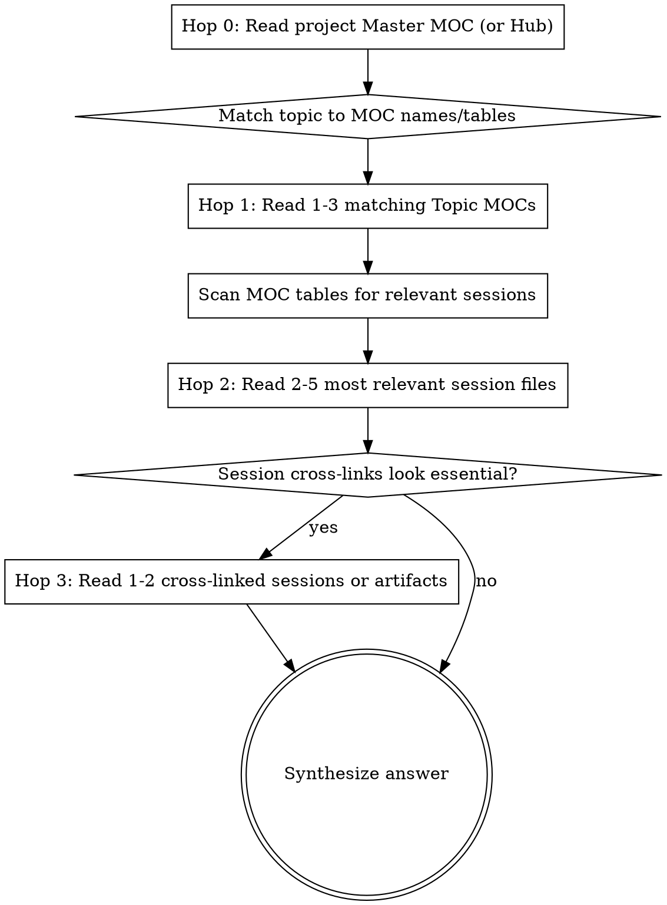

# Harpoon — Graph-Walking Context Retrieval

Retrieve context from the Obsidian Agent Context Vault by **navigating the knowledge graph through MOCs**, not by scanning session files.

## Invocation

- `/harpoon <topic or question>` — direct query, scoped to the current project
- `/harpoon <topic> in <project>` — query a specific project
- `/harpoon <topic> --all` — query across all projects (use sparingly; expensive)
- `/harpoon` — ask the user what they want to know

## The Rule

**NEVER grep or glob session files directly. Always enter through a MOC.**

You are navigating a knowledge graph like a human in Obsidian — clicking hub nodes, following links, hopping between connected files. You are NOT a search engine.

## Resolve the Vault Root

Run this command with the Bash tool:

```bash
v="${AGENT_CONTEXT_VAULT%/}"; echo "vault=${v:-UNSET}"; [ -d "$v" ] && echo "status=ok" || echo "status=missing"
```

- `vault=UNSET` → stop and tell the user:

  > `AGENT_CONTEXT_VAULT` is not set. Add `{ "env": { "AGENT_CONTEXT_VAULT": "/absolute/path/to/vault" } }` to `~/.claude/settings.json`, then start a new session.

- `status=missing` → stop and tell the user that the vault directory does not exist at the printed path.
- `status=ok` → use the printed path as `<vault>` in every path below. Use it exactly as printed (case-sensitive). Do not search for the vault anywhere else.

## Determining Scope

1. If the user specified `in <project>`, use that as `<project>`.
2. If the user passed `--all`, set scope to all project folders — read each project's Master MOC at Hop 0 and pick the best-matching project before descending.
3. Otherwise, use the basename of the current working directory as `<project>`.

Project folder lives at `<vault>/<project>/`.

If that folder does not exist, tell the user:

> No vault folder for `<project>`. Try `/harpoon <topic> --all` or `/harpoon <topic> in <project-name>`.

and stop.

## Graph Traversal Algorithm



### Hop 0 — Entry Point

Read the project's root hub, in this preference order:

1. `<project>/00 - Master MOC.md`
2. `<project>/00 - <project> Hub.md`
3. `<project>/00 - Archive Hub.md`
4. Any file in `<project>/` starting with `00 -`
5. The root-level project stub `<project>.md` (which should link to the hub)

If none exists, fall back to globbing `<project>/*MOC*.md` and reading up to 2 matches.

### Hop 1 — Find the Right MOCs

The Master MOC lists topic MOCs in a table. Match the user's topic against those MOC names and descriptions. Read 1-3 matching Topic MOCs.

**Generic matching heuristics (the MOCs themselves may not exist in every project):**

| Topic keywords | Look for MOCs named like... |
|---|---|
| bug, error, crash, regression | `Bug Tracker MOC`, `Bugs MOC` |
| migration, upgrade, port | `* Migration MOC` |
| architecture, pattern, design | `Architecture Patterns MOC`, `Design System *` |
| database, query, schema | `Database * MOC`, `MongoDB MOC`, `MSSQL MOC` |
| aws, s3, sqs, lambda | `AWS Services MOC` |
| api, routing, middleware | `Express * MOC`, `API MOC` |
| timeline, history, chronological | `Timeline MOC` |
| module, file, subsystem | `Project Module MOC` |
| billing, contracts, licensing | `Billing * MOC`, `Contracts MOC` |
| reports, scheduling, jobs | `Report * MOC`, `Cron MOC` |

If no obvious topic MOC matches, use `Timeline MOC` (chronological) or read the top 1-2 MOCs listed in the Master MOC.

### Hop 2 — Read Relevant Sessions

MOC tables link sessions with one-line descriptions. Pick the 2-5 sessions most relevant to the query. Read them.

### Hop 3 — Follow Cross-Links (Optional)

If a session's `## Related` / `## Artifacts` sections or inline `[[wiki links]]` point to another session, **artifact**, or concept stub that looks essential, follow it. Max 2 additional reads.

**Artifacts are in `<project>/artifacts/` and are especially valuable** — they contain the original plan/design/spec that drove the work, often more detailed than the session summary.

### Fallback — Topic Not in Any MOC

If Hop 1 finds no matching MOC, grep ONLY the MOC files (not session files, not artifacts):

```
Grep pattern across <project>/*MOC*.md
```

If still nothing, widen to root-level concept stubs (e.g. `MSSQL.md`, `SQS.md`). If still nothing, tell the user the topic is not in the vault for this project.

## Constraints

- **Max 10 file reads total** per query
- **Track files read** — never re-read a file
- **MOC-first always** — session files and artifacts are only read when a MOC or session points to them
- **No sequential scanning** — never glob all `.md` files and read through them

## Output Format

```markdown
## Harpoon: <topic>

**Project:** <project>
**Trail:** Master MOC → <MOC name(s)> → <session 1>, <session 2>, <artifact if any>

### Answer
<synthesized answer drawing from the traversed files>

### Key Sessions
- [[session-file]] — what it contributes to the answer
- [[session-file]] — ...

### Key Artifacts
- [[artifact-file]] — plan/design/spec that is directly relevant
<omit this section if no artifacts were read>

### Related Topics
- [[wiki-link]] — for further exploration
```

## Red Flags — You Are Doing It Wrong

| If you're doing this... | Stop and... |
|------------------------|-------------|
| Grepping session files for keywords | Read the Master MOC first |
| Globbing all .md files | Enter through a MOC |
| Reading more than 10 files | You have enough context, synthesize |
| Reading a session not linked from a MOC | Go back to the MOC and find the right link |
| Skipping Hop 0 | Always start at the project's Master MOC / Hub |
| Assuming hardcoded MOC names | The MOCs vary per project — read the Master MOC table to discover them |
